# 🎓 Student Performance Prediction System

A production-grade, end-to-end machine learning system for predicting student academic performance and identifying at-risk students — built with XGBoost, FastAPI, and a live intervention dashboard.

---

## 📸 Overview

This project builds a complete student performance prediction pipeline — from synthetic data generation through to a live-scoring REST API and browser dashboard. It predicts whether a student is at risk of failing based on academic, behavioural, and demographic features, and provides personalised intervention recommendations for educators.

**Model Performance:**
| Metric | Score |
|---|---|
| ROC-AUC | 0.9758 |
| PR-AUC | 0.9993 |
| Precision | 0.9817 |
| Recall | 0.9959 |
| F1 Score | 0.9888 |

---

## 🗂️ Project Structure

```
Student-Performance-Prediction/
├── generate_data.py          # Synthetic student data generator (10K students)
├── verify_setup.py           # Environment & dependency checker
├── main.py                   # Pipeline runner (--phase generate/ingest/all)
├── requirements.txt          # Python dependencies
├── .gitignore
│
├── data/                     # Generated at runtime (gitignored)
│   ├── students.csv
│   ├── students.parquet
│   ├── X_train / y_train / X_test / y_test (.parquet)
│   ├── feature_list.joblib
│   ├── numeric_features.joblib
│   └── categorical_features.joblib
│
├── notebooks/
│   ├── 01_ingest.py          # Schema enforcement + validation
│   ├── 02_eda.py             # 7 EDA charts → outputs/
│   ├── 03_features.py        # Feature engineering + sklearn pipeline
│   ├── 04_train.py           # XGBoost + Optuna (50 trials) + evaluation
│   └── 05_explain.py         # SHAP waterfall, beeswarm, dependence plots
│
├── models/                   # Generated at runtime (gitignored)
│   ├── xgb_student_model.joblib
│   ├── preprocessor.joblib
│   ├── optimal_threshold.joblib
│   ├── best_params.joblib
│   └── eval_metrics.joblib
│
├── outputs/                  # Charts generated at runtime (gitignored)
│
├── serving/
│   ├── api.py                # FastAPI app (4 endpoints)
│   └── __init__.py
│
└── app/
    └── dashboard.html        # EduGuard live dashboard
```

---

## ⚙️ Setup

### 1. Clone & create virtual environment

```bash
git clone https://github.com/Neha-Joshi05/student-performance-prediction.git
cd Student-Performance-Prediction

python -m venv venv
# Windows:
venv\Scripts\activate


### 2. Install dependencies

```bash
pip install -r requirements.txt
pip install pyarrow
```

### 3. Verify environment

```bash
python verify_setup.py
```

---

## 🚀 Running the Pipeline

```bash
# Phase 1 — Generate & ingest data
python generate_data.py
python notebooks/01_ingest.py

# Phase 2 — EDA & feature engineering
python notebooks/02_eda.py
python notebooks/03_features.py

# Phase 3 — Train model & explain
python notebooks/04_train.py
python notebooks/05_explain.py

# Phase 4 — Serve API
uvicorn serving.api:app --reload --port 8000
```

---

## 📊 Dataset

Synthetic dataset of **10,000 students** with realistic academic patterns:

| Property | Value |
|---|---|
| Total students | 10,000 |
| At-risk rate | ~30% |
| Features (raw) | 13 |
| Features (engineered) | 27 |

**Features include:**
- Demographics: gender, school type, parent education
- Academic: prior GPA, quiz average, assignment average, midterm score
- Behavioural: study hours/week, LMS logins, on-time submission %, forum posts
- Logistics: commute time

**Engineered features:** academic composite, engagement score, risk flags (low attendance, weak midterm, low LMS), cyclical ratios, and interaction terms.

---

## 🤖 Model

| Component | Detail |
|---|---|
| Algorithm | XGBoost (`XGBClassifier`) |
| Tuning | Optuna TPE sampler, 50 trials |
| Objective | Maximise ROC-AUC |
| Preprocessing | sklearn `ColumnTransformer` (StandardScaler + OneHotEncoder) |
| Split | Stratified 80/20 train/test |
| Threshold | Optimal F1 threshold (tuned post-training) |

---

## 🔍 Explainability

SHAP charts generated after running `notebooks/05_explain.py`:

- **Beeswarm** — global feature impact across all predictions
- **Bar chart** — mean |SHAP| feature importance ranking
- **Dependence plots** — top 4 features vs their SHAP values
- **Waterfall (highest-risk)** — breakdown for most at-risk student
- **Waterfall (borderline)** — breakdown for borderline passing student

---

## 🌐 API

Start the API:

```bash
uvicorn serving.api:app --reload --port 8000
```

### Endpoints

| Method | Endpoint | Description |
|---|---|---|
| `GET` | `/` | Health check |
| `GET` | `/metrics` | Model performance metrics |
| `POST` | `/predict` | Predict single student risk |
| `POST` | `/predict/batch` | Predict up to 500 students |

### Interactive Docs
- Swagger UI → [http://localhost:8000/docs](http://localhost:8000/docs)
- ReDoc → [http://localhost:8000/redoc](http://localhost:8000/redoc)

### Example Request

```bash
Invoke-RestMethod -Method Post -Uri http://localhost:8000/predict `
  -ContentType "application/json" `
  -Body '{
    "gender": "M",
    "school_type": "Govt",
    "parent_edu": "HSC",
    "prior_gpa": 5.2,
    "attendance_pct": 55.0,
    "quiz_avg": 38.0,
    "assign_avg": 42.0,
    "midterm": 36.0,
    "study_hours_wk": 2.0,
    "on_time_submit_pct": 50.0,
    "lms_logins_wk": 1.0,
    "forum_posts": 0.0,
    "commute_min": 90.0
  }'
```

### Example Response

```json
{
  "pass_probability": 0.1823,
  "is_at_risk": true,
  "risk_level": "CRITICAL",
  "risk_score": 0.8177,
  "threshold_used": 0.483,
  "interventions": [
    "⚠️ Attendance below 60% — prioritise class presence immediately",
    "📚 Increase study hours to at least 5–7 hrs/week",
    "📝 Midterm score is weak — schedule remedial sessions",
    "🧠 Low quiz average — review core concepts weekly"
  ],
  "timestamp": "2024-03-15T09:22:11.042Z"
}
```

---

## 🖥️ Dashboard (EduGuard)

Open `app/dashboard.html` in your browser while the API is running.

Features:
- Live API connection status (auto-ping every 15s)
- One-click At-Risk / On-Track sample presets
- Animated pass probability meter
- Personalised intervention recommendations
- Live student feed with risk badges (LOW / MEDIUM / HIGH / CRITICAL)
- Session stats: at-risk count, on-track count, average pass probability
- Probability history chart (last 20 predictions)
- Model F1 and ROC-AUC pulled live from API

---

## 📈 EDA Charts

Generated to `outputs/` after running `python notebooks/02_eda.py`.

### Class Distribution
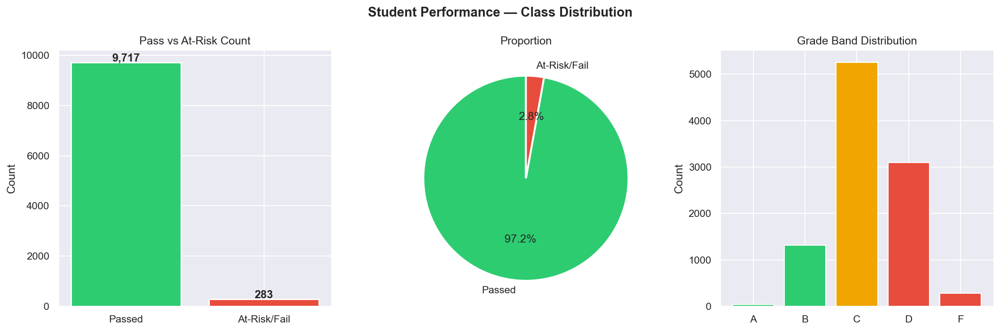

### Score Distributions — Pass vs At-Risk
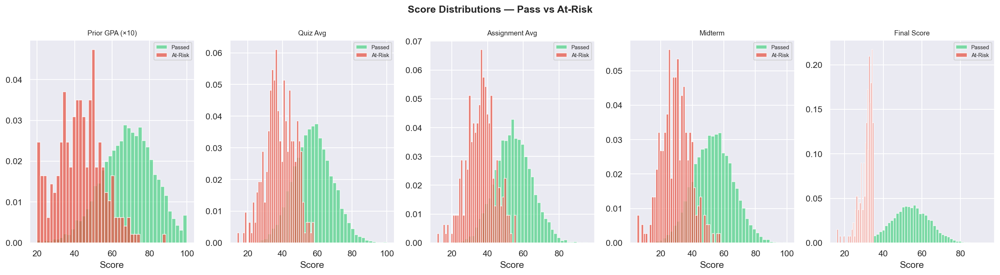

### Attendance & Study Hours
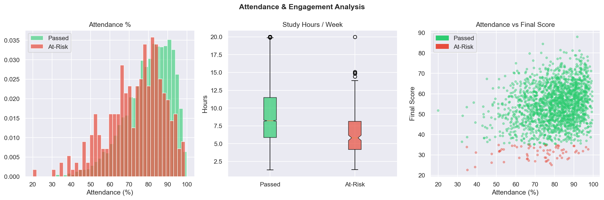

### Demographic Risk Analysis
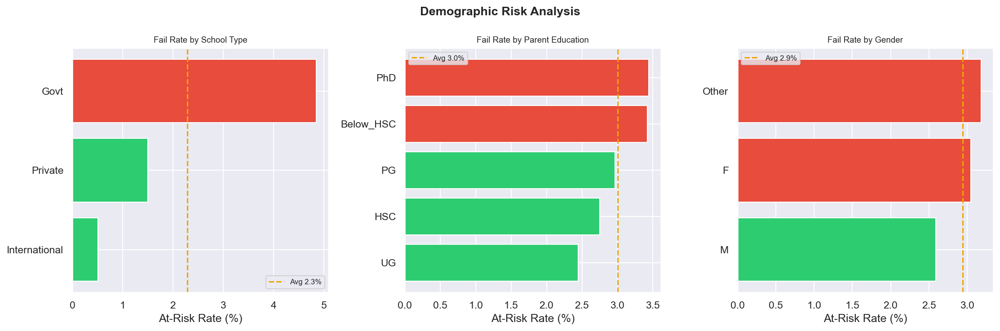

### LMS Engagement
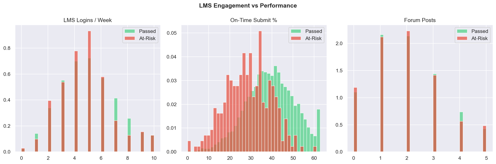

### Feature Correlation Heatmap
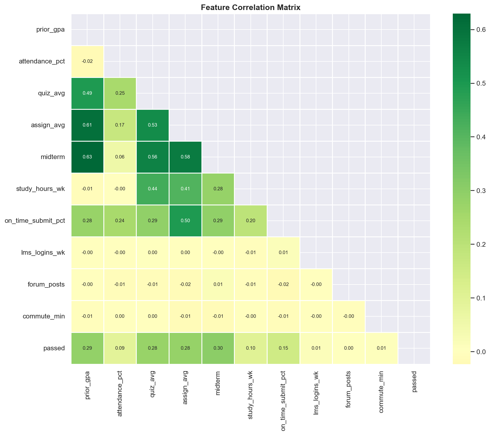

### At-Risk vs Passing Student Profile
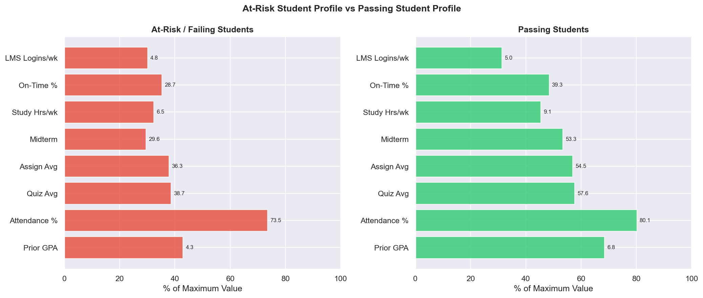

---

## 📉 Model Evaluation Charts

Generated to `outputs/` after running `python notebooks/04_train.py`.

### ROC & Precision-Recall Curves
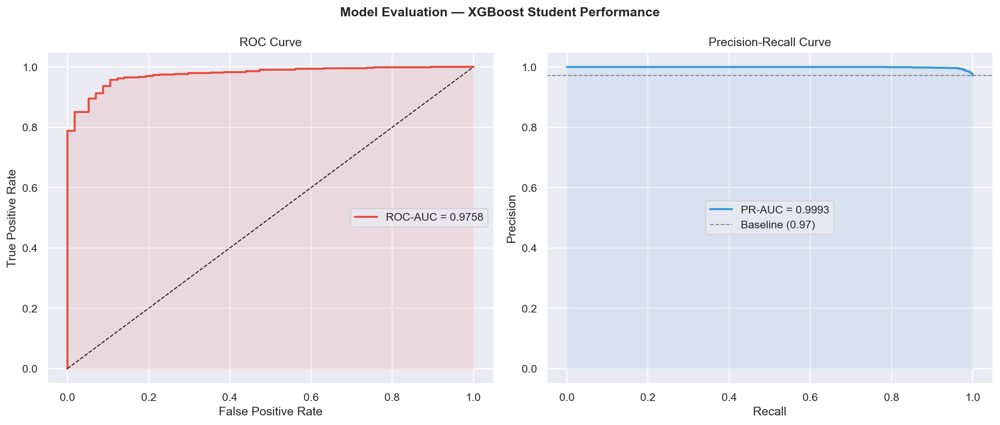

### Confusion Matrix
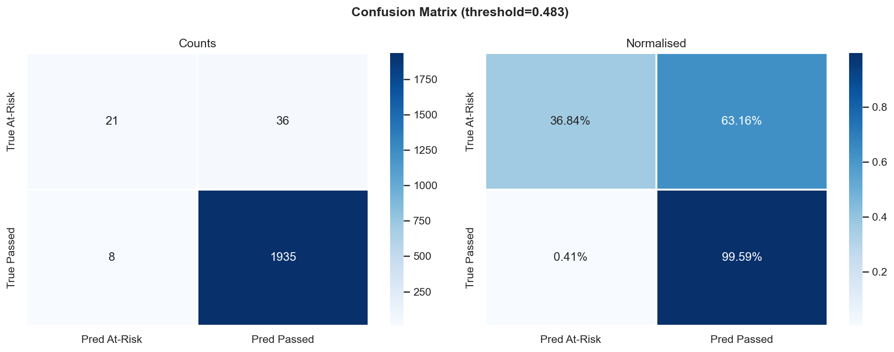

### Feature Importance
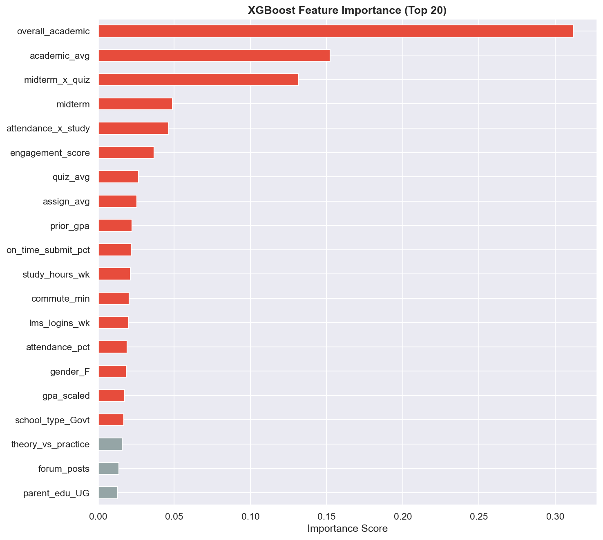

### Score Distribution
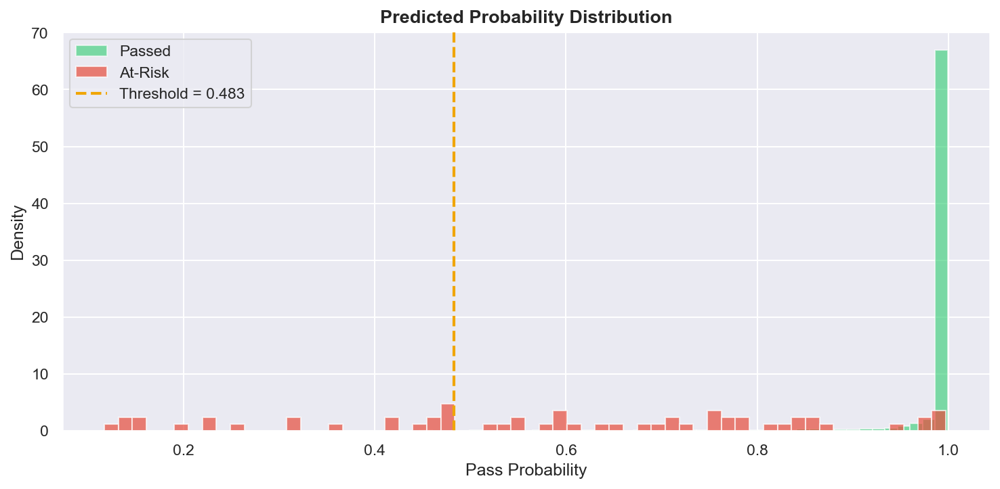

### Optuna Hyperparameter Search
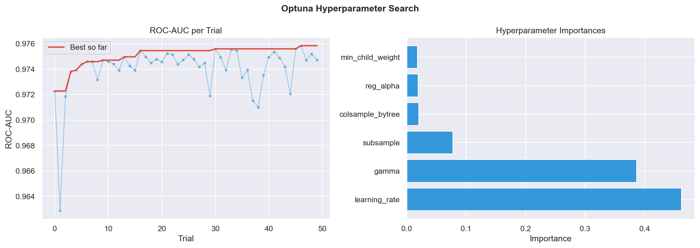

### F1 Score vs Threshold
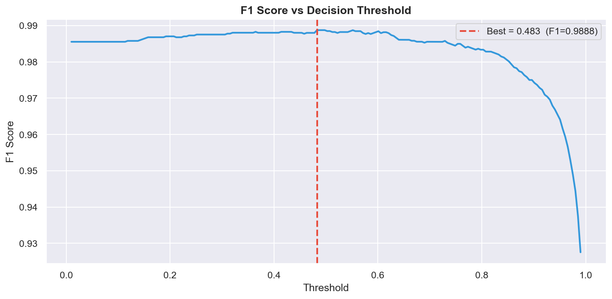

---

## 🔍 SHAP Explainability Charts

Generated to `outputs/` after running `python notebooks/05_explain.py`.

### SHAP Beeswarm — Global Feature Impact
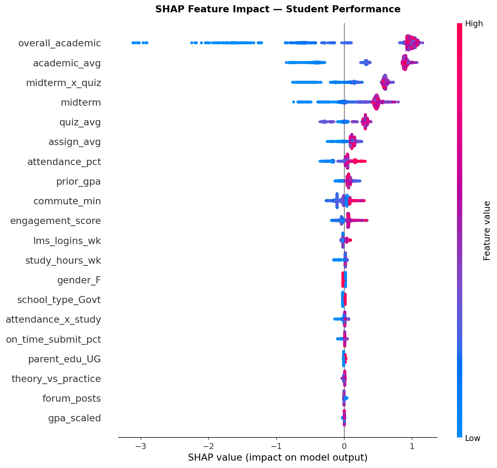

### SHAP Bar — Mean |SHAP| Importance
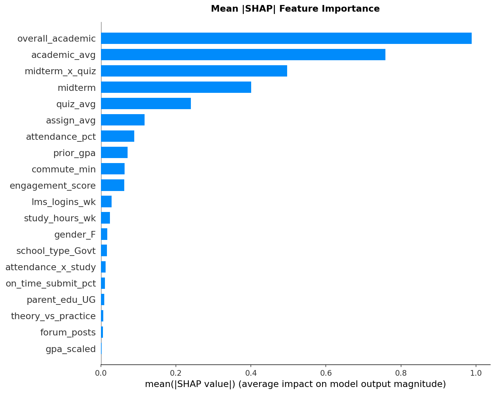

### SHAP Dependence Plots — Top 4 Features
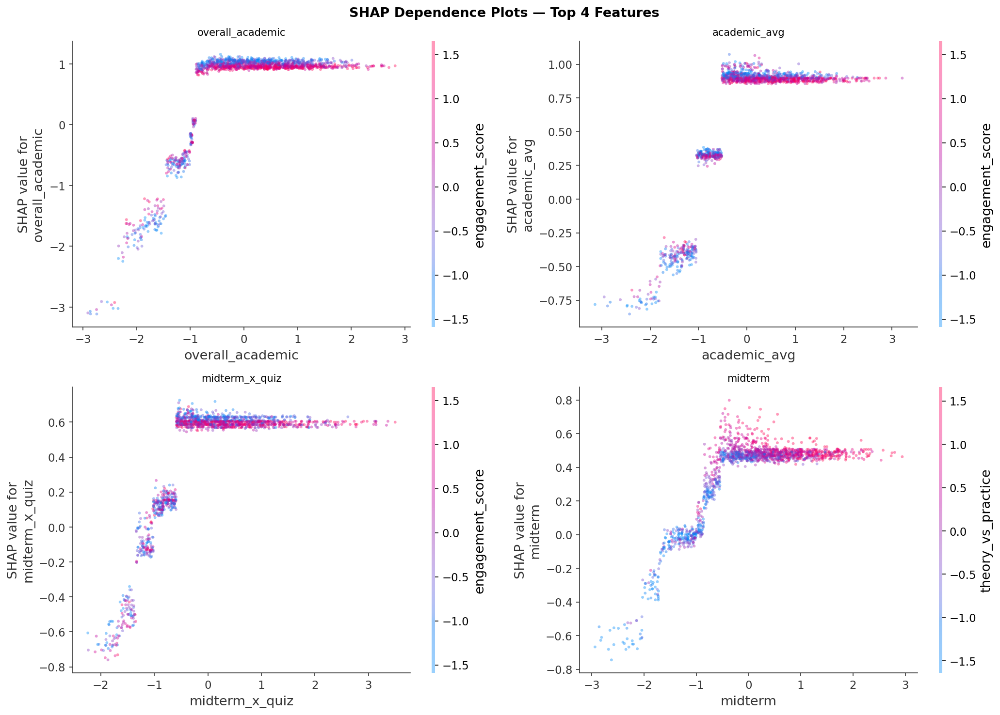

### SHAP Waterfall — Highest-Risk Student
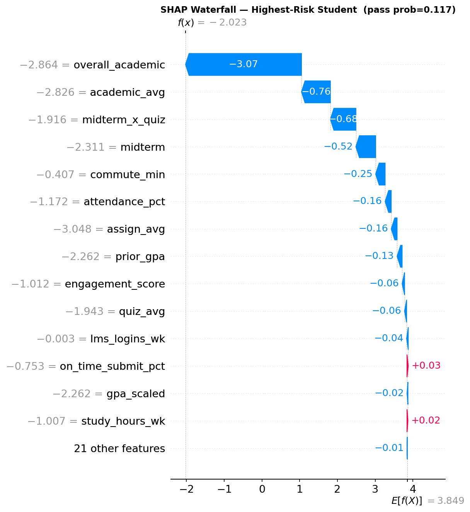

### SHAP Waterfall — Borderline Passing Student
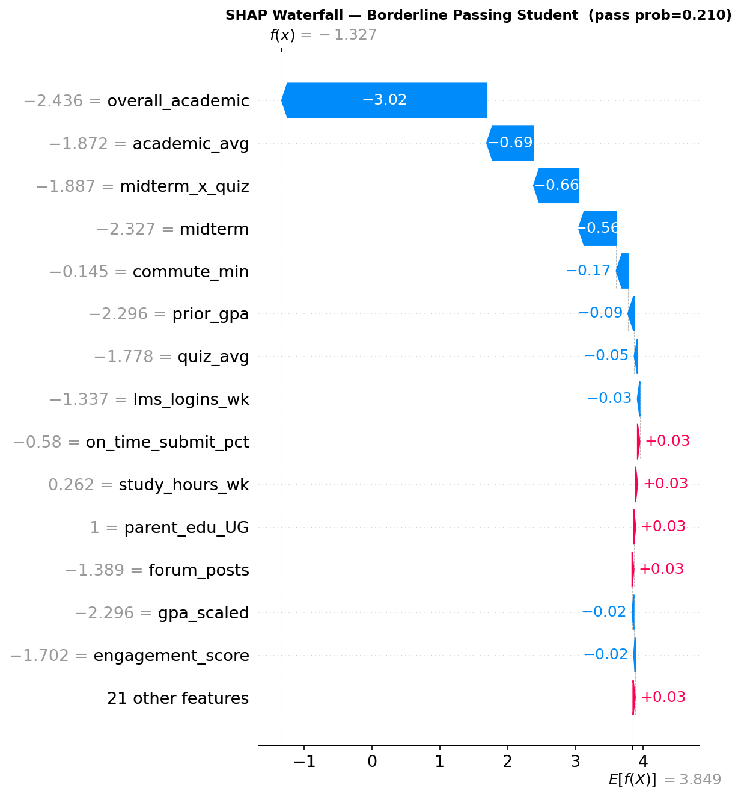

---

## 🛠️ Tech Stack

| Layer | Technology |
|---|---|
| Data | pandas, numpy, pyarrow |
| ML | XGBoost, scikit-learn |
| Tuning | Optuna (TPE sampler) |
| Explainability | SHAP |
| Preprocessing | sklearn ColumnTransformer + Pipeline |
| Visualisation | matplotlib, seaborn |
| API | FastAPI, uvicorn, pydantic |
| Persistence | joblib |
| Dashboard | Vanilla HTML/CSS/JS |

---

## 🏫 Real-World Applications

Systems like this are used by:

- **Coursera & edX** — identify learners likely to drop out and trigger re-engagement
- **University early-alert systems** — flag struggling students for academic counselling
- **School districts** — resource allocation for tutoring and intervention programs
- **Ed-tech platforms** — personalise learning paths based on predicted performance
- **Government education departments** — policy decisions on scholarship and support

---


## 🙏 Acknowledgements

- [XGBoost](https://xgboost.readthedocs.io/)
- [Optuna](https://optuna.org/)
- [SHAP](https://shap.readthedocs.io/)
- [FastAPI](https://fastapi.tiangolo.com/)
- [scikit-learn](https://scikit-learn.org/)